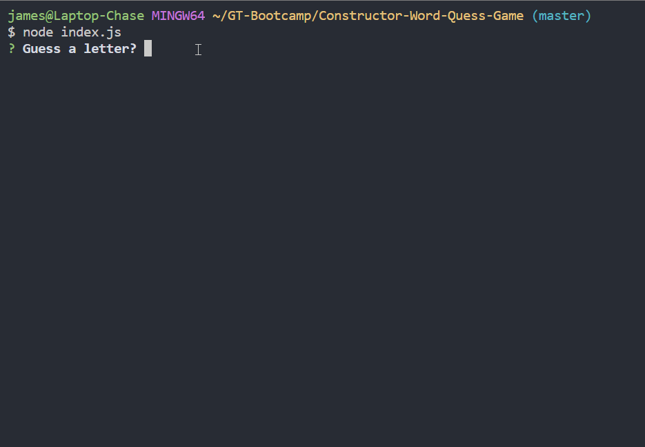

# Constructor-Word-Quess-Game

A node word guess command-line game using constructor functions.

## What I learned

- How to create constructors within classes to organize javascript to initialize an object
- How to export the classes and use them in another javascript document
